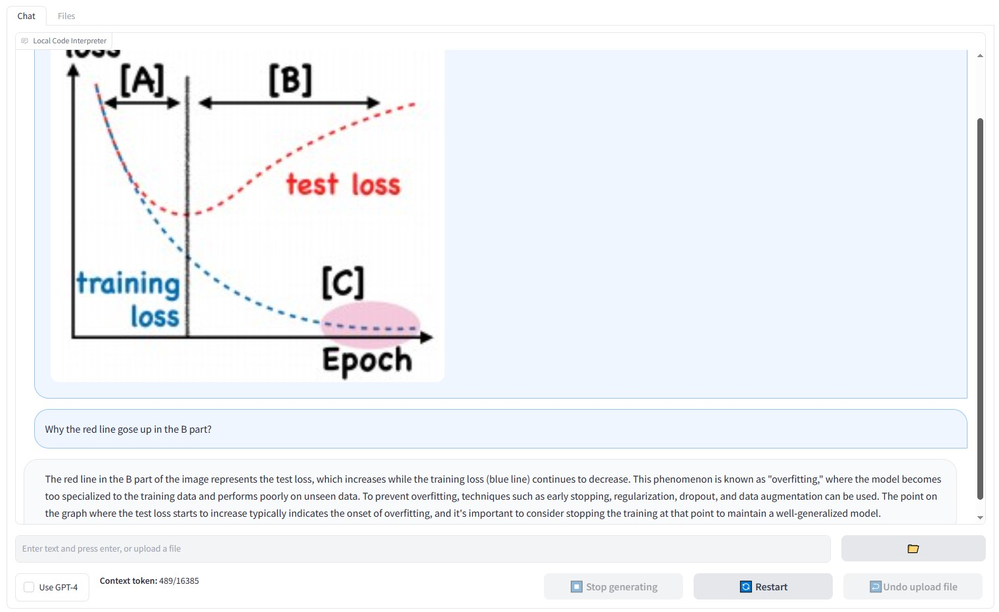
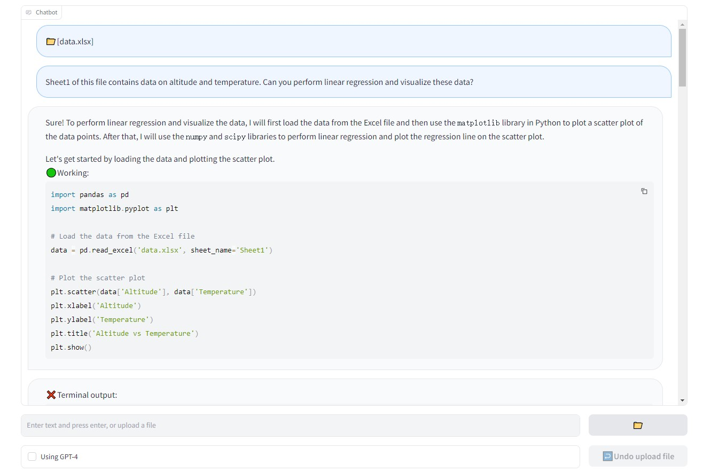
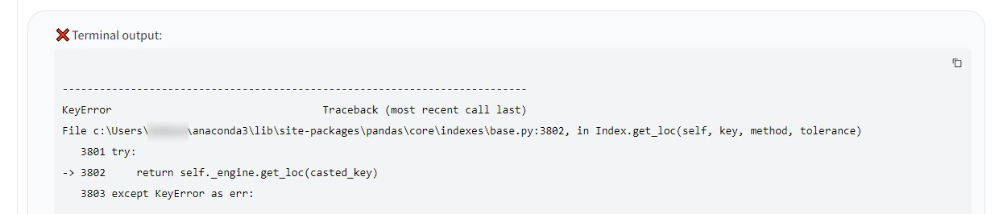
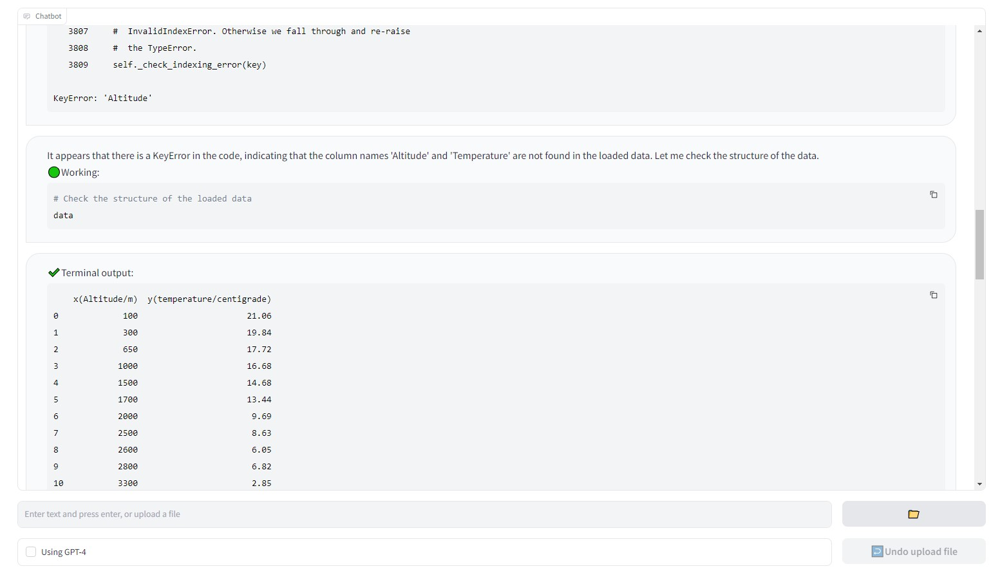
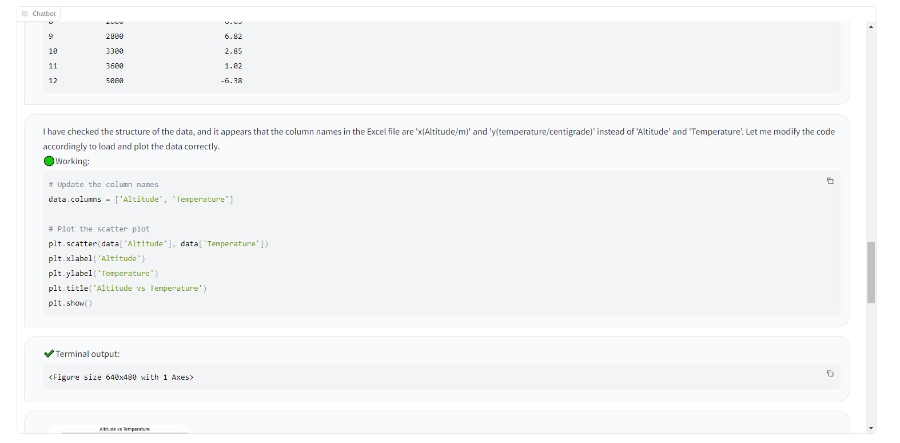
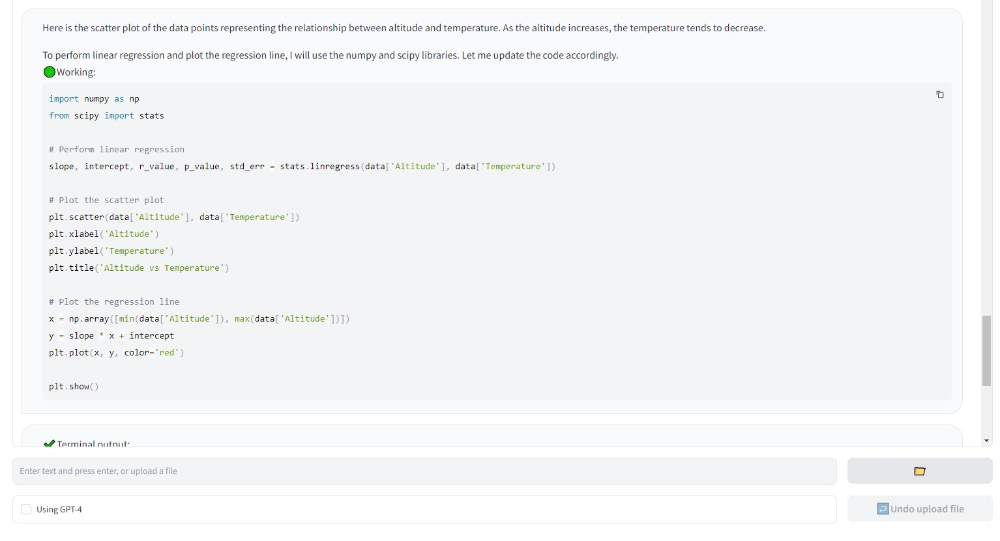
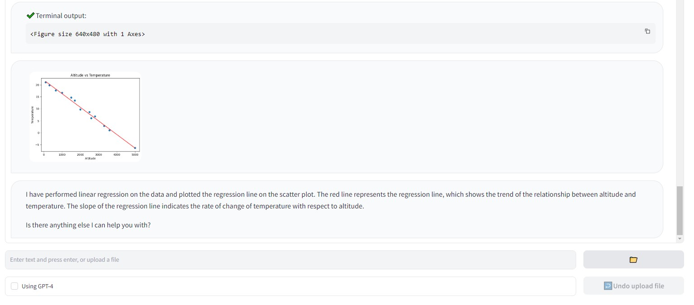

**Read in other language: [English](README.md)**

# 本地代码解释器
OpenAI的ChatGPT代码解释器（Code Interpreter或Advanced Data Analysis）的本地版。

## 简介

OpenAI的ChatGPT代码解释器（Code Interpreter，现更名为Advanced Data Analysis）是一款强大的AI工具。然而，其在在线沙箱环境中运行代码的特性导致了一些限制，如包的缺失、上传速度较慢、仅支持上传不超过100MB的文件以及代码最多只能运行120秒等。为此，我们推出了本地代码解释器（Local Code Interpreter）。这款工具允许您在自己的设备上，利用自己专属的Python环境来执行ChatGPT生成的代码，从而解除了原有解释器的各种限制。


## 优势

- **自定义环境**：在您本地环境中运行代码，确保各种依赖都已正确安装。

- **无缝体验**：告别100MB文件大小限制和网速问题。使用本地版代码解释器，一切尽在掌控之中。

- **可用GPT-3.5**：官方代码解释器只能在GPT-4中使用，但现在您甚至可以在一轮对话中自由切换GPT-3.5和GPT-4。

- **数据更安全**：代码在本地运行，无需将文件上传至网络，提高了数据的安全性。

- **支持Jupyter**：本程序可将代码和对话历史保存至Jupyter notebook文件中供以后使用。

## 注意事项
在您自己的设备上执行AI生成但未经人工审核的代码可能存在安全风险。在运行此程序前，您应当采用一些安全措施，例如使用虚拟机，以保护您的设备和数据。使用此程序所产生的所有后果，您需自行承担。

## 使用方法

### 安装

1. 克隆本仓库
   ```shell
   git clone https://github.com/MrGreyfun/Local-Code-Interpreter.git
   cd Local-Code-Interpreter
   ```

2. 安装依赖。该程序已在Windows 10和CentOS Linux 7.8上使用Python 3.9.16测试。所需的库及版本：
   ```text 
   Jupyter Notebook    6.5.4
   gradio              3.39.0
   openai              0.27.8
   ansi2html           1.8.0 
   ```
   其他系统或库版本也可能有效。请注意，不要将`openai`包升级至最新的`1.x`版本，该版本已重写，与旧版本不兼容。
   您可以使用以下命令直接安装所需的软件包：
   ```shell
   pip install -r requirements.txt
   ```
   如果您不熟悉Python，可以使用以下命令安装，它将额外安装常用的Python数据分析库：
   ```shell
   pip install -r requirements_full.txt
   ```
### 配置

1. 在`src`目录中创建一个`config.json`文件，参照`config_example`目录中提供的示例进行配置。

2. 在`config.json`文件中配置您的API密钥。

请注意：
1. **正确设置`model_name`**
    该程序依赖于`0163`及以上版本的模型的函数调用能力，这些模型包括：
    - `gpt-3.5-turbo-0613` (及其16K版本)
    - `gpt-3.5-turbo-1106`
    - `gpt-4-0613` (及其32K版本)
    - `gpt-4-1106-preview` 

   旧版本的模型将无法使用。请注意，`gpt-4-vision-preview`模型同样不支持函数调用，因此不能将其设置为`GPT-4`模型。

   对于使用Azure OpenAI的用户：
   - 请将`model_name`设置为您的模型的部署名（deployment name）。
   - 确认部署的模型是`0613`及以上版本。

2. **API版本设置**
    如果您使用Azure OpenAI服务，请在`config.json`文件中将`API_VERSION`设置为`2023-07-01-preview`，其他API版本不支持函数调用。

3. **视觉模型设置**
   尽管`gpt-4-vision-preview`模型不支持函数调用，我们仍然通过另一种非端到端的方式实现了图像输入。如果想使用图像输入，请将`gpt-4-vision-preview`设置为`GPT-4V`模型，并设置`available`字段设置为`true`。当不需要使用图像输入时候，可以将`available`字段设置为`false`，这将移除图像相关的系统提示，从而减少您的API费用。
   
4. **模型上下文窗口长度设置**
    `model_context_window` 字段记录了每个模型的上下文窗口长度信息。当对话长度超过模型上下文窗口长度限制时，本程序会使用该信息来压缩对话长度。
    Azure OpenAI的用户需要按照以下格式，使用模型的部署名手动添加上下文窗口长度信息：
    ```json
    "<模型部署名>": <上下文窗口长度 (整数)>
    ```
    此外，当OpenAI推出新模型的时候，您可以按照相同的格式手动添加新模型的上下文窗口长度信息。（我们会持续更新该文件，但是不一定及时）

5. **使用环境变量配置密钥**
    如果您不希望将API密钥存储在`config.json`文件中，可以选择通过环境变量来设置密钥：
    - 将`config.json`文件中的`API_KEY`设为空字符串：
        ```json
        "API_KEY": ""
        ```
    - 在运行程序之前，使用您的API密钥设置环境变量`OPENAI_API_KEY`：
        - Windows：
        ```shell
        set OPENAI_API_KEY=<你的API密钥>
        ```
        - Linux：
        ```shell
        export OPENAI_API_KEY=<你的API密钥>
        ```

## 使用

1. 进入`src`目录。
   ```shell
   cd src
   ```

2. 运行以下命令：
   ```shell
   python web_ui.py
   ```

3. 在浏览器中访问终端生成的链接，开始使用本地版代码解释器。

4. 添加`-n`或`--notebook`参数可以将对话保存到Jupyter notebook中。 
   默认情况下，该Jupyter notebook文件保存在工作目录中，您可以添加路径以将其保存到其它位置。
   ```shell
   python web_ui.py-n<path_to_notebook>
   ```

## 示例

以下是一个使用本程序进行线性回归任务的示例：

1. 上传数据文件并要求模型对数据进行线性回归：
   

2. 生成的代码执行中遇到错误：
   

3. ChatGPT自动检查数据格式并修复bug：
   

4. 修复bug后的代码成功运行：
   

5. 最终结果符合要求：
   
   
